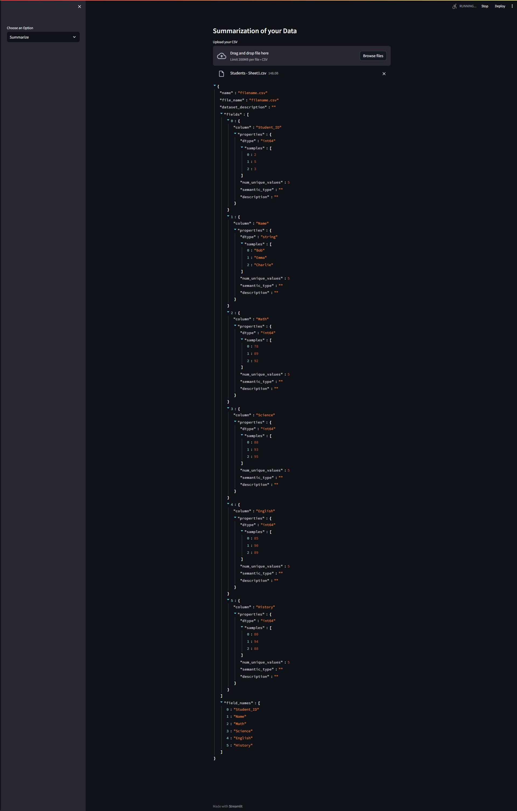

# LIDA: Language-based Interactive Data Analysis

LIDA (Language-based Interactive Data Analysis) is a powerful tool designed to assist users in the automatic creation of visualizations. It addresses various subtasks such as understanding the semantics of data, enumerating relevant visualization goals, and generating visualization specifications. LIDA leverages well-orchestrated pipelines based on Large Language Models (LLMs) and Image Generation Models (IGMs) to accomplish these tasks.

## Features
- **Summarizer**: Converts data into a rich yet compact natural language summary.
- **Goal Explorer**: Enumerates visualization goals based on the given data.
- **VisGenerator**: Generates, refines, executes, and filters visualization code.
- **Infographer**: Produces data-faithful stylized graphics using IGMs.

## Key Components
1. **Manager Module**:
    - Responsible for managing different components of LIDA.
    - Utilizes Large Language Models (LLMs) for text generation and understanding.

2. **Text Generation Configuration**:
    - Allows users to configure text generation parameters such as the number of samples (n), temperature, and cache usage.

3. **Visualization Generation Workflow**:
    - **Data Summarization**: Converts raw data into natural language summaries.
    - **Goal Enumeration**: Enumerates potential visualization goals based on the summarized data.
    - **Visualization Code Generation**: Generates, refines, executes, and filters visualization code.
    - **Infographic Creation**: Produces stylized graphics and infographics using Image Generation Models (IGMs).

## Demo

## Resources
- [LIDA Official Documentation](https://microsoft.github.io/lida/)
- [LIDA GitHub Repository](https://github.com/microsoft/lida)

Explore the power of LIDA to enhance your data analysis and visualization capabilities! For further details and advanced usage, refer to the official documentation and GitHub repository.